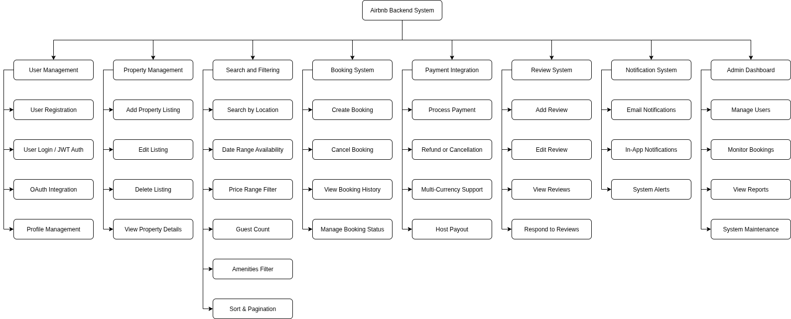

# Features and Functionalities

## Core Functionalities
These are the main backend features, it answers the question "What".

| Category              | Description                                                | Example Features                                         |
| --------------------- | ---------------------------------------------------------- | -------------------------------------------------------- |
| **User Management**   | Handles registration, authentication, and profile updates. | Sign Up, Login, Logout, Profile Update, Role Management  |
| **Property Listings** | CRUD operations for hosts’ properties.                     | Add Listing, Edit Listing, Delete Listing, View Listings |
| **Search & Filter**   | Allows users to discover properties based on filters.      | Search by Location, Filter by Price, Pagination          |
| **Booking System**    | Handles reservations and status tracking.                  | Create Booking, Cancel Booking, View Booking Status      |
| **Payments**          | Processes payments and payouts securely.                   | Process Payment, Refund, Manage Currencies               |
| **Reviews & Ratings** | Feedback from guests and hosts.                            | Add Review, Edit Review, Display Ratings                 |
| **Notifications**     | Communicates updates via email/app.                        | Booking Confirmation, Payment Alert, Cancellation Notice |
| **Admin Dashboard**   | Controls system-wide management.                           | Manage Users, Manage Bookings, View Reports              |

## Technical Features
These are the internal technical capabilities that enable the above core functionalities; it answers the question "How".

| Aspect                             | Description                                                                       |
| ---------------------------------- | --------------------------------------------------------------------------------- |
| **Database Management**            | PostgreSQL schema with tables for Users, Properties, Bookings, Payments, Reviews. |
| **API Development**                | RESTful endpoints using Express.js or Django REST Framework.                      |
| **Authentication & Authorization** | JWT-based sessions; role-based access (guest, host, admin).                       |
| **File Storage**                   | Cloud storage for property images (AWS S3 or local file storage).                 |
| **Third-Party Integrations**       | Stripe / PayPal for payments, SendGrid for emails.                                |
| **Error Handling & Logging**       | Centralized error responses, audit logs, validation errors.                       |

##  Non-Functional Requirements
Non-functional requirements define system qualities and constraints that ensure the system meets user and operational expectations.

| Quality Attribute | Implementation                                    |
| ----------------- | ------------------------------------------------- |
| **Scalability**   | Modular architecture; load balancing.             |
| **Security**      | Data encryption, password hashing, rate-limiting. |
| **Performance**   | Caching (Redis), optimized queries.               |
| **Testing**       | Unit & integration tests for all endpoints.       |
| **Documentation** | API specs via Swagger / OpenAPI.                  |

## System Overview Diagram
Below is a high-level view of all backend features and how they relate:

