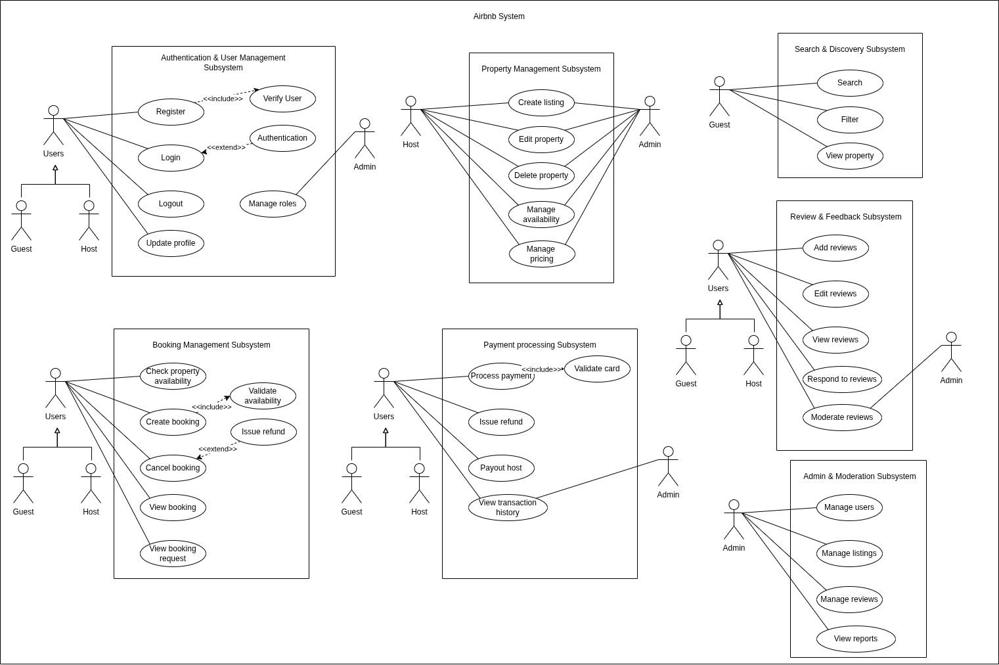

# Airbnb Backend Use Case Diagram

This document presents the Airbnb backend use cases organized by subsystem. Each subsystem encapsulates related functionalities and defines its own actors, boundaries, and core use cases. This structure demonstrates decoupling and aligns with Clean Architecture principles, where each subsystem operates independently but interacts through defined interfaces.

**Subsystems:** Authentication, Property, Search, Booking, Payment, Review, and Admin.

**Actors:** Guest, Host, Admin.

